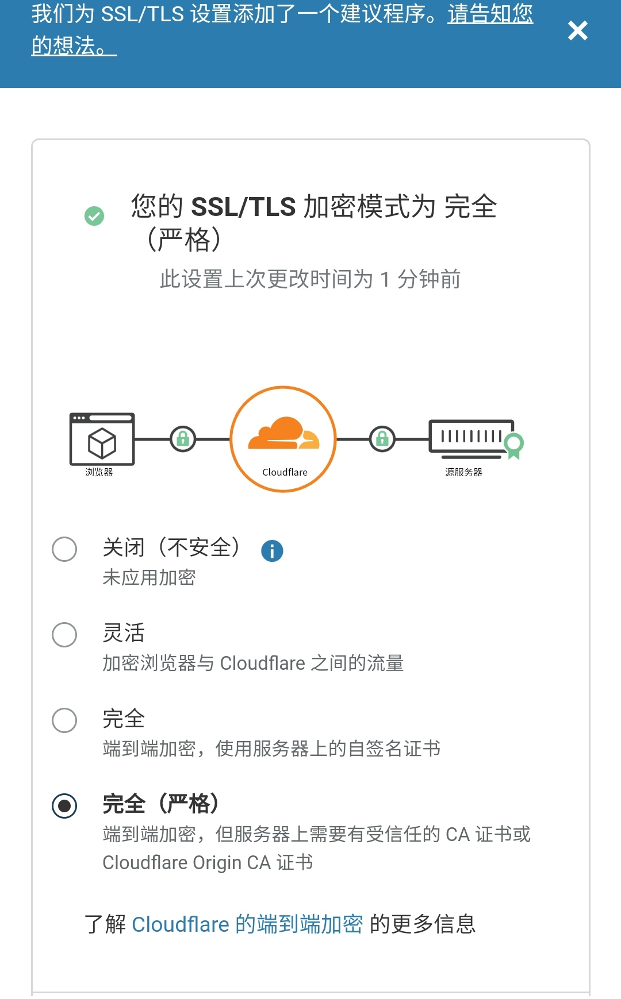
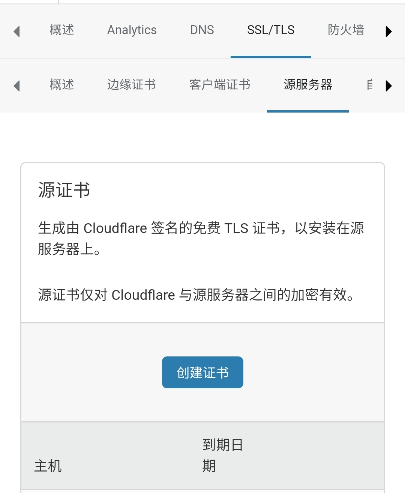

# shadowsocks_install  
[](https://github.com/yiguihai/shadowsocks_install/actions/workflows/build.yml)  
### 使用方法
```Shell
wget --no-check-certificate -O /usr/local/bin/ss-main https://github.com/yiguihai/shadowsocks_install/raw/dev/usr/bin/ss-main
chmod +x /usr/local/bin/ss-main&&ss-main
```
查看状态
```Shell
systemctl status ss-main
```
取消开机自启
```Shell
systemctl disable ss-main
```
<details><summary><code>Screenshot</code></summary><br>

</details>

### cloudflare中转流量  
使用nginx分流比直接中转慢了许多我个人不建议使用分流  
购买域名与解析不再赘述，(可以申请使用freenom的免费域名)  
ping 自己的域名得到cloudflare的ip基本完成了。
1. 在cloudflare控制台把ssl/tls加密模式改为完全。  
2. 在本脚本添加一个443端口的v2ray插件用户  

或者直接改为80端口cf加密模式使用灵活  
复制终端输出的链接导入ss客户端，然后测试能不能联网然后把服务器改为自己的域名或者cloudflare的节点ip完成收工  

<details><summary><code>Screenshot</code></summary><br>
<br>  

</details>  

### 注意事项 
* 终端输出的 ss://类型链接和二维码图形 仅保证兼容安卓客户端，其它系统自行测试。
* 使用kcptun与quic协议插件的时候无法代理udp,因为此类插件使用udp协议监听在udp端口所以为防止冲突脚本启动ss-server时只开放tcp防止造成冲突出错退出。
* 客户端显示数量仅供参考使用插件情况下不支持统计
* 默认对流量用超的端口进行删除，开机自启重新统计所有端口流量  
* Centos系列系统使用本脚本时：如果Shadwosocks客户端连接不上的可能需要自己关闭防火墙  

###  Android  
[shadowsocks-android](https://github.com/shadowsocks/shadowsocks-android)  
[simple-obfs-android](https://github.com/shadowsocks/simple-obfs-android)  
[kcptun-android](https://github.com/shadowsocks/kcptun-android)  
[simple-tls-android](https://github.com/IrineSistiana/simple-tls-android)  
[v2ray-plugin-android](https://github.com/shadowsocks/v2ray-plugin-android)  

### 延伸阅读  
1. [再谈如何在Freenom免费注册tk域名 - 码农之家](https://blog.a-hacker.com/1503.html)  
2. [域名如何做三级域名泛解析](https://www.5v13.com/linux/18940.html)  
3. [Trojan+V2ray(VLESS+Xtls)+WordPress,通过Nginx的SNI实现共用443端口](https://www.v2rayssr.com/trojanv2rayvlessxtlswordpress.html)  
4. [ss + v2ray-plugin 使用](https://zwc365.com/hide/shadowsocks-v2ray-plugin.html)  
5. [Trojan 共用 443 端口方案](https://www.chengxiaobai.cn/record/trojan-shared-443-port-scheme.html)  
6. [识别与 Cloudflare 的代理兼容的网络端口](https://support.cloudflare.com/hc/zh-cn/articles/200169156-%E8%AF%86%E5%88%AB%E4%B8%8E-Cloudflare-%E7%9A%84%E4%BB%A3%E7%90%86%E5%85%BC%E5%AE%B9%E7%9A%84%E7%BD%91%E7%BB%9C%E7%AB%AF%E5%8F%A3)
7. [Nginx中常用的模块整理](https://blog.poetries.top/2018/11/27/nginx-module-summary/)
8. [给你的站点添加 DNS CAA 保护](https://segmentfault.com/a/1190000011097942)
