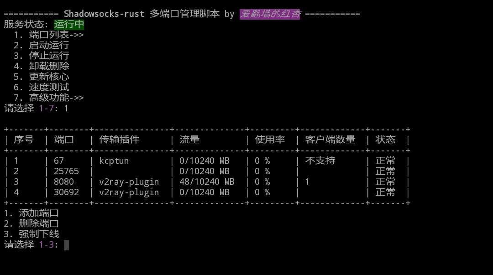

# shadowsocks_install
shadowsocks-rust版多用户安装管理脚本  
已经做到自动化每日编译服务端核心文件。强迫症可以每天进脚本看看有没有更新了。😃

### 使用方法

```Shell
wget --no-check-certificate -O /usr/local/bin/ss-main https://github.com/yiguihai/shadowsocks_install/raw/master/bin/ss-main
chmod +x /usr/local/bin/ss-main
ss-main
```
查看状态
```Shell
systemctl status ss-main
```
取消开机自启
```Shell
systemctl disable ss-main
```
<details><summary><code>Screenshot</code></summary><br>

</details>

### 注意事项
* 终端输出的 ss://类型链接和二维码图形 仅保证兼容安卓客户端，其它系统自行测试。
* 使用kcptun与quic协议的插件时候无法代理udp,因为此类插件使用udp协议监听在udp端口所以为防止冲突脚本启动ss-server时只开放tcp防止造成冲突出错退出。
* 客户端显示数量仅供参考使用插件情况下无法正常统计
* 默认对流量用超的端口删除，开机自启重新统计所有端口流量  
* 脚本不会对防火墙做任何操作，Centos系列系统使用本脚本时：如果Shadwosocks客户端连接不上的可能需要自己关闭防火墙

###  Android  
[shadowsocks-android](https://github.com/shadowsocks/shadowsocks-android)  
[simple-obfs-android](https://github.com/shadowsocks/simple-obfs-android)  
[kcptun-android](https://github.com/shadowsocks/kcptun-android)  
[simple-tls-android](https://github.com/IrineSistiana/simple-tls-android)  
[v2ray-plugin-android](https://github.com/shadowsocks/v2ray-plugin-android)  
